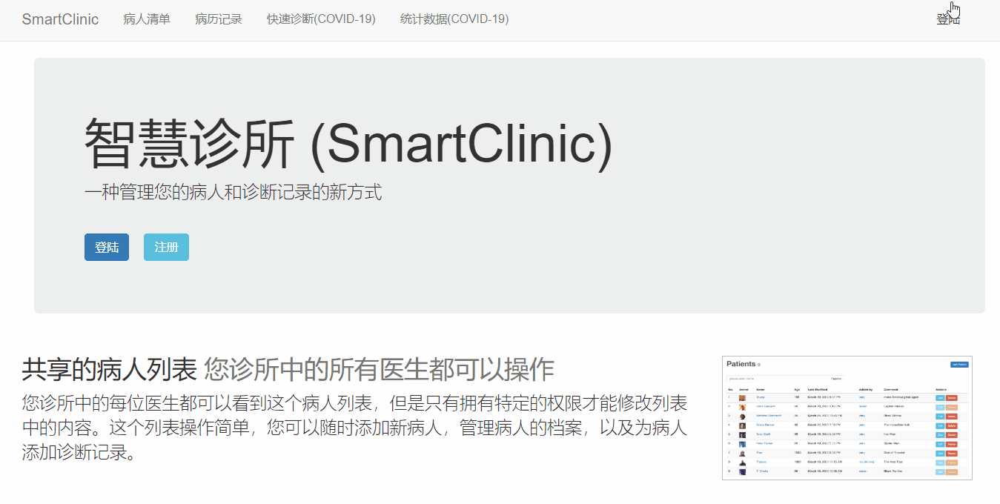
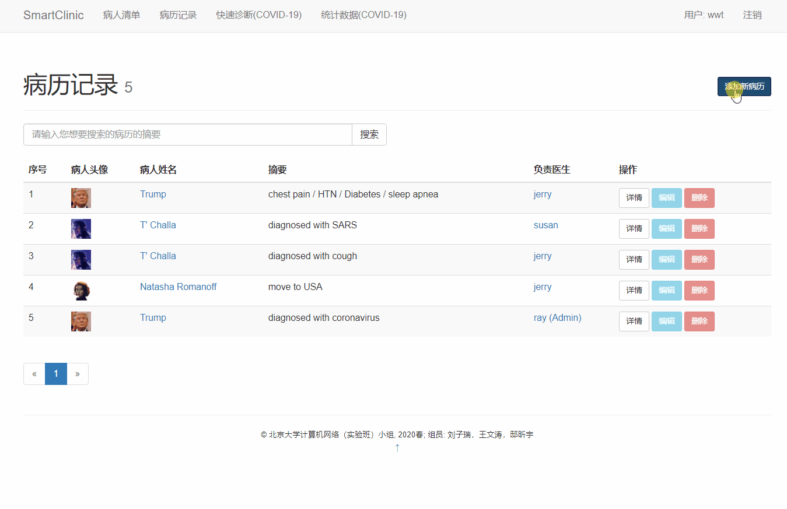
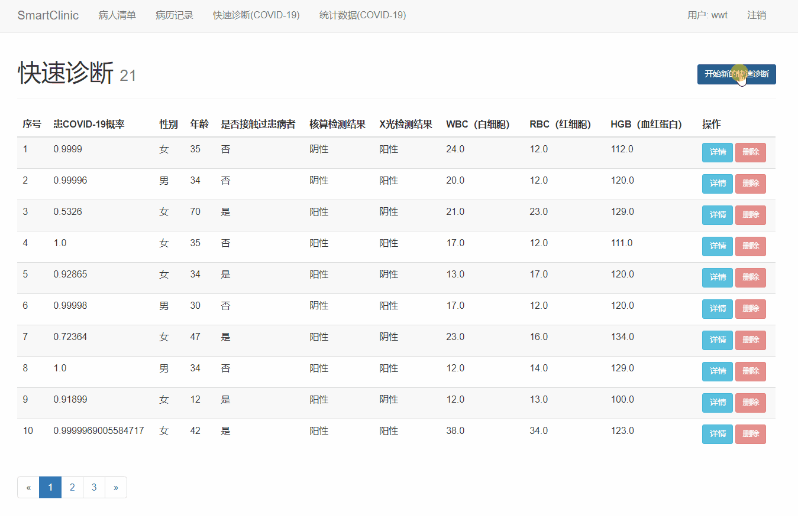

# SmartClinic

A project for 2020 PKU Computer Network. We build a new way to manage patients and clinical records. A neural 
network prediction model is added to help you quickly identify COVID-19 carriers. 

This project is based on Flask + Pytorch + Nginx + Gunicorn + Docker.

We have deployed this project [here](https://39.97.247.225/).

## File Structure

Here we explain the core documents in our project. 

* **app** : The Flask APP   
app              
├── **\_\_init\_\_.py** : initialize Flask app  
├── **email.py** : send the reset password email  
├── **errors.py** : handle 404 and 505 errors  
├── **evaluator** : the neural network prediction model  
├── **forms.py** : define the forms  
├── **models.py** : define the classes used in database  
├── **routes.py** : routers, implement functions for different URLs  
├── **static** : static resources used by HTML templates  
├── **templates** : html templates and mail templates  
└── **utils.py** : assisting functions for routers  

* **config.py** : The parameters used in this project  
* **requirements.txt** : The package requirements in this project  

## API Document

* method: get, post  
  url: '/' or '/index'  
  return: render_template("home.html")  
  description: render homepage  
  
* method: get, post  
  url: '/login'   
  return: render_template('login.html')   
  description: login     

* method: get  
  url: '/logout'  
  return: redirect(url_for('index'))  
  description: logout   

* method: get, post  
  url: '/register'  
  return: render_template('register.html')  
  description: register a new user     
  
* method: get    
  url: '/user/\<username\>'  
  return: render_template('user.html')  
  description: display a user's profile    

* method: get, post      
  url: '/edit_profile'  
  return: render_template('edit_profile.html')  
  description: edit a user's profile   
  
* method: get, post      
  url: '/reset_password_request'  
  return: render_template('reset_password_request.html')  
  description: send reset password request mail  
  
* method: get, post      
  url: '/reset_password/\<token\>'    
  return: render_template('reset_password.html')  
  description: reset password, token is used for encryption, it only remains valid for 5 minutes  
    
* method: get, post  
  url: '/patient_profile/\<int: unit_id\>'  
  return: render_template("patient_profile.html")  
  description: render patient profile, and add clinical record for the patient  
 
* method: get, post  
  url: '/dashboards'  
  return: render_template("dashboards.html")   
  description: send the contents in database to HTML, display the contents in database  
  
* method: get
  url: '/record/manage'  
  return: render_template("manage_record.html")   
  description: display clinical records in database   
  
* method: get, post  
  url: '/record/add'    
  return: render_template("add_record.html")  
  description: add clinical record to database  
 
* method: post  
  url: '/record/\<int:record_id\>/delete'   
  return: redirect_back()  
  description: delete a clinical record with ID = record_id  
  
* method: get, post  
  url: '/record/\<int:record_id\>/edit'  
  return: render_template("edit_record.html")   
  description: edit a clinical record that already exists in database, redirect back to the last page after editing operation    

* method: get, post  
  url: '/unit/add'   
  return: render_template("add_unit.html")  
  description: add a new patient to database and redirect back to the last page  
  
* method: get
  url: '/unit/manage'   
  return: render_template("manage_unit.html")    
  description: display patients in database   
  
* method: post  
  url: '/unit/\<int:unit_id\>/delete'  
  return: redirect_back()   
  description: delete a patient with ID = unit_id  
  
* method: get, post  
  url: '/unit/\<int:unit_id\>/edit'
  return: render_template("edit_unit.html")  
  description: edit a patient's profile, redirect back to the last page after done  
  
* method: get   
  url: '/unit/\<int:unit_id\>/settings/avatar'    
  return: render_template("change_avatar.html")   
  description: change avatar for a patient, redirect back after done   
  
* method: post  
  url: '/unit/\<int:unit_id\>/settings/avatar/upload'   
  return: redirect(url_for('change_avatar', unit_id=unit.id))    
  description: upload avatar to database   
  
* method: post  
  url: '/unit/\<int:unit_id\>/settings/avatar/crop'   
  return: redirect(url_for('change_avatar', unit_id=unit.id))    
  description: crop avatar in database  
  
* method: get  
  url: '/avatars/\<path:filename\>'   
  return: send_from_directory(app.config['AVATARS_SAVE_PATH'], filename)    
  description: get avatar in database  
  
* method: get, post      
  url: '/quick_evaluation'  
  return: render_template('quick_evaluation.html')  
  description: display the evaluation records in database  
  
* method: get, post      
  url: '/add_evaluation'  
  return: render_template('add_evaluation.html')  
  description: add a new evaluation to database  
  
* method: post      
  url: '/delete_evaluation/\<int:evaluation_id\>'  
  return: redirect_back()   
  description: delete a evaluation record with ID = evaluation_id in database  

## Deployment

We first show how to deploy our project using Docker.
 
We also provide a version without Docker.

### Setup(Docker Version)

#### Installation

1. Install Docker.

   ~~~shell
   #Uninstall old versions
   sudo apt-get remove docker docker-engine docker.io containerd runc
   #Setup the repository
   sudo apt-get update
   
   sudo apt-get install \
       apt-transport-https \
       ca-certificates \
       curl \
       gnupg-agent \
       software-properties-common
   #Add Docker's official GPG key
   curl -fsSL https://download.docker.com/linux/ubuntu/gpg | sudo apt-key add -
   #Install Docker Engine
   sudo apt update
   sudo apt install docker-ce docker-ce-cli containerd.io
   ~~~

   Refer [Docker's official website](https://docs.docker.com/get-docker/) for more details.

2. Download image from  [Docker Hub](https://hub.docker.com/).

   ~~~shell
   docker pull primavera/compnet
   ~~~

#### Usage

1. Create a container from the image.

~~~shell
docker run -it -p 80:80 --name new_compnet primavera/compnet
~~~

2. Enter the directory.

~~~shell
cd /deploy/compNet/
~~~

3. Start Nginx.

~~~shell
service nginx start
~~~

4. Start Gunicorn.

~~~shell
gunicorn -w 4 -b 127.0.0.1:8000 app:app
~~~

----

### Setup(without Docker Version)

#### Requirement

See file `requirements.txt`

#### Installation

1. Install virtualenv.

~~~shell
pip3 install virtualenv
~~~

2. Install dependence.

~~~shell
pip3 install -r requirements.txt
~~~

3. Install Pytorch.

Select a proper version of Pytorch on [this website](https://pytorch.org/get-started/locally/).

3. Setup Nginx.

Replace `default.conf` in `/etc/nginx/sites-enabled/` by `compNet.conf`.

~~~shell
mv ./compNet.conf /etc/nginx/sites-enabled/
~~~

5. Activate virtual environment.

~~~shell
source ./venv/bin/activate
~~~

6. Start Gunicorn.

~~~shell
gunicorn -w 4 -b 127.0.0.1:8000 app:app
~~~

## Demos

Here shows some operations of our project. 

* login with username and password
  
* add and view a patient
  
* add and view a record
  
* add and view a COVID-19 test
  
* view statistics of all COVID-19 tests
  
